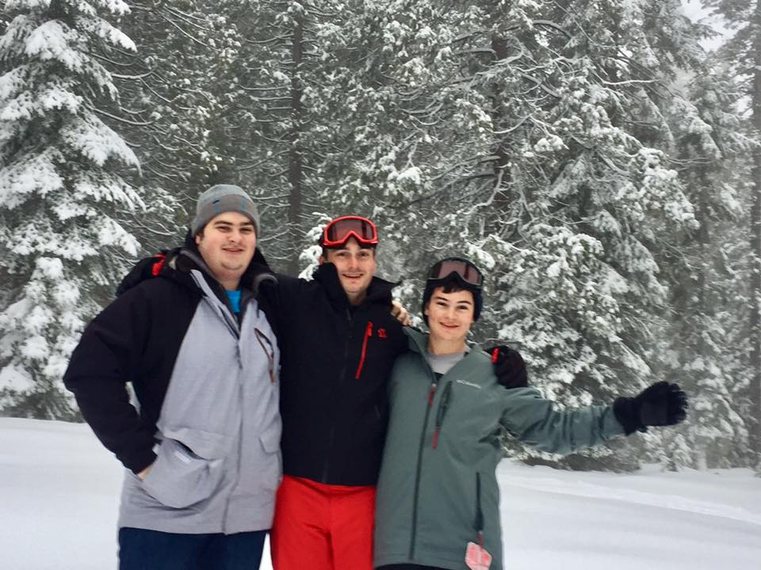

# **Introducing Matthew Green**
### **UC San Diego Senior majoring in Mathematics - Computer Science**
Born in Charlotte North Carolina, raised in Ventura California, and currently residing in Oceanside. I grew up as the middle child with two brothers and continue to stay close to my family. 

 


[Before transferring to UC San Diego I graduated from one of America's top City Colleges (Santa Barbara City College) with really good grades.](really%20good%20grades.png)

### **Some of my hobbies include:**

- Skiing
- [Barbecue](#top-5-cuts-of-meat-to-barbecue)
- Gaming
  - Super Smash Bros Melee
  - World of Warcraft
  - Dota 2
  - StarCraft II
  - Chess
  - ect.
- Camping
- Hiking
- Fishing

### **Past Projects:**
- World's largest prime number database, allowing the lookup of the Nth prime number, from 1 to 3*10^12, inclusive. The database is stored in S3 buckets and generated by streaming prime numbers via the sieve of Eratosthenes algorithm.
```
def sieve(n):
    flags = numpy.ones(n, dtype=bool)
    flags[0] = flags[1] = False
    for i in range(2, int(n ** 0.5) + 1):
        if flags[i]:
            flags[i * i::i] = False
    return numpy.flatnonzero(flags)
```
- Medtwice, my dad's medical website/youtube channel with nearly 30,000 subscribers and over 7.5 million views. I designed the website and recorded and edited the vast number of videos.
- Medtwice Pregnancy by Weeks Android app. A companion app to Medtwice that tracks the new mothers current week in pregnancy and gives the relavent videos and links to help guide them through their pregnancy.

### **Top 5 Cuts of Meat to Barbecue:**
1. Brisket
2. Tri tip
3. Boston Butt
4. Baby Back Ribs
5. Prime Rib

### **Life Plans:**
- [ ] Graduate from UC San Diego
- [ ] ?
- [ ] Profit